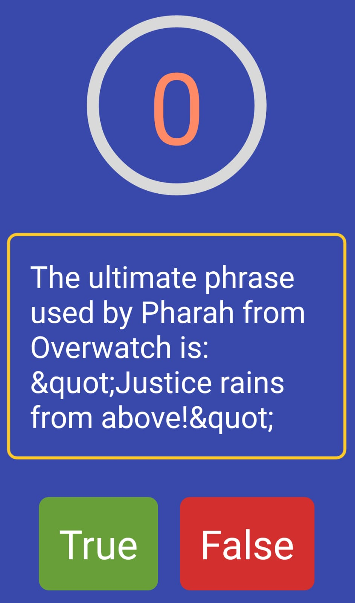

<h1 align="center">Wissenswettbewerb</h1>


## Description

=> Mit diesem Projekt haben wir ein intelligentes Spiel entwickelt, 
das mit der API, die wir aus der Triva-Datenbank erhalten haben, Zeit spart.

=> Um einen Countdown-Timer zu verwenden, haben wir react-native-countdown-circle-timer
heruntergeladen.

=> Beim Empfang von Daten zwischen Komponenten, haben wir react-redux verwendet.


## This is a short video introduction about this app.





### At the end of the project, following topics are to be covered;

- HTML
- CSS
- JS
- [React-Native](https://reactnative.dev/)
- [React-Navigation](https://reactnavigation.org/)


## How To Use

To clone and run this application, you'll need [Git](https://git-scm.com) and [Node.js](https://nodejs.org/en/download/) (which comes with [npm](http://npmjs.com)) installed on your computer. From your command line:

```bash

$ git clone https://github.com/KamilCetiner/Wissenswettbewerb.git

$ npm install

$ npx react-native run-android

```
## PACKAGES

```bash

$ npm install @react-navigation/native

$ npm i react-native-modal

$ npm install --save react-native-vector-icons

$ npm install react-native-countdown-circle-timer

$ npm install react-native-gesture-handler

$ npm install react-native-safe-area-context

$ npm install react-native-screens

$ npm react-native-svg

$ npm react-native-vector-icons

$ npm react-redux

$ npm redux


```

## Contact

- GitHub [@Kamil](https://github.com/KamilCetiner)
- Linkedin [@Kamil](https://www.linkedin.com/in/kamil-%C3%A7etiner-b09a601ab/)